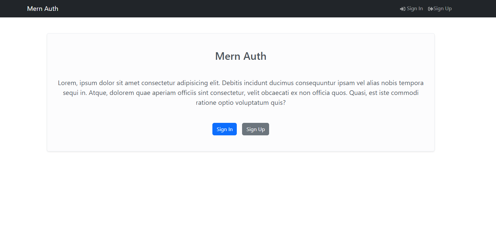

## Mern Auth

Complete Mern Auth using React, vite, Node and Express,  

## Features
Redux toolkit,
Image upload, 
Forget Password via email

react-bootstrap 


## 🚀 About Me
I'm a full stack developer with more than 3 years of experience!


## Installation

Install my-project with npm

```bash
      clone or feth the app

      cd mern-auth

      npm Install

      npm run server => for nodemon server
      npm run client => for react start
      npm run both => for concurrently start 
```
    


